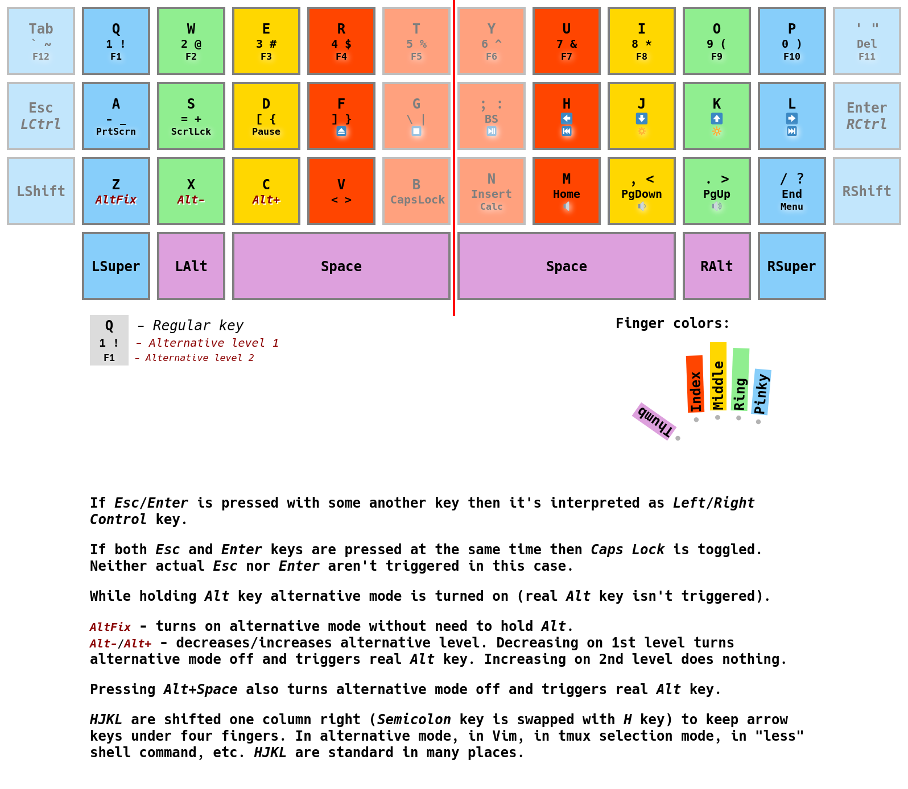

# xlib-keys-hack

[](https://travis-ci.org/unclechu/xlib-keys-hack)

Keyboard behavior customization utility.

A scheme of what I achieved by using these options (just an example):
- `--hold-alt-for-alternative-mode`
- `--ergonomic-mode`
- `--shift-hjkl`

Full command to run (with my _Ducky One 2 Mini_ keyboard as an example):
``` bash
xlib-keys-hack \
  --hold-alt-for-alternative-mode --ergonomic-mode --shift-hjkl \
  '/dev/input/by-id/usb-Ducky_Ducky_One2_Mini_RGB_DK-V1.08-190201-event-if03' \
  '/dev/input/by-id/usb-Ducky_Ducky_One2_Mini_RGB_DK-V1.08-190201-event-kbd' \
  '/dev/input/by-id/usb-Ducky_Ducky_One2_Mini_RGB_DK-V1.08-190201-if01-event-mouse' \
  '/dev/input/by-id/usb-Ducky_Ducky_One2_Mini_RGB_DK-V1.08-190201-if01-mouse' \
  '/dev/input/by-id/usb-Ducky_Ducky_One2_Mini_RGB_DK-V1.08-190201-if02-event-kbd' \
  --disable-xinput-device-name='Ducky Ducky One2 Mini RGB'
```

_P.S. It's just one of possible ways to configure this tool,
it's neither limited to this nor urge you to remap your keyboard so radical,
see detailed [usage info](#--help) for all possible options._



**WARNING!** Work in progress, not released yet, look at
[tasks board](https://github.com/unclechu/xlib-keys-hack/projects/1?fullscreen=true).
Anyway, I'm using this tool for years already for myself, it's kinda in constant
development. It's hard to prepare it to use for everyone since even the idea is
not that simple to understand. You could use it right now, I'm keeping `master`
branch pretty stable, by doing all experimental stuff in `dev` branch, just ask
me for details personally:
- In [XMPP/Jabber](https://xmpp.org/software/clients.html):
  [unclechu@jabjab.de](xmpp:unclechu@jabjab.de?message)
- In [Matrix](https://riot.im/app/): @unclechu:matrix.org

__**TODO**__ This description isn't complete yet,
             and some of it isn't true anymore.

- Simulation of pressing `Escape` key when press `Caps Lock` key without any combos;
- Simulation of pressing and holding third-level modificator by `Left Alt + Caps Lock`
  and simulation of releasing this key by `Right Alt`;
- Simulation of pressing real `Caps Lock` by `Caps Lock + Enter`
  (because `Caps Lock` used as additional `Left Ctrl`);
- Simulation of pressing real `Enter` by `Enter` key without any combos
  (because `Enter` key used as additional `Right Ctrl`);
- Pressing `Caps Lock` without any combos key that simulates `Escape` key
  also turns off caps lock mode, third-level mode
  and resets keyboard layout to first layout;
- Moving focus to another window resets keyboard layout to first layout,
  turns off caps lock mode and third-level mode;
- `Right Alt` works as resetter to all of modes (third-level shift, caps lock)
  and resets keyboard layout to first layout;
- Notifying my XMobar FIFO PIPE about third-level modificator, `Num Lock` and `Caps Lock`
  state to make indicators of these on panel
  ([see here for more details](https://github.com/unclechu/xmonadrc/blob/master/xmobar-cmd.sh)).

## Requirements

- [Haskell Tool Stack](https://haskellstack.org/)
- Development files of `libX11`, `libXtst` and `libXrandr`
  (for `X11` dependency)
- Development files of `libxml2` (for `libxml-sax` dependency)
- Development files of `libgmp` (for some other dependencies)
- Superuser access (for giving to yourself read access permission (using ACL)
  to keyboard device file descriptor)

## Build and install

``` bash
$ make --always-make
```

Application binaries supposed to be installed by `stack` to `$HOME/.local/bin`
directory, make sure you have this directory in your `$PATH` environment variable.

## Run (as daemon)

1. For first you need to give read access permission to yourself (your user)
   to keyboard device file descriptor.

   You could easily do it for all input devices by this command:

   ``` bash
   $ sudo setfacl -m "u:$(whoami):r" /dev/input/by-id/*
   ```

   Keep in mind that after reboot or physically replug of your keyboard
   this permission will be reset (it's planned to describe solution about
   writing own systemd service to automate this).

2. For example you could have one keyboard and two file descriptors of device:

   ``` text
   /dev/input/by-id/usb-1d57_2.4G_Receiver-event-kbd
   /dev/input/by-id/usb-1d57_2.4G_Receiver-event-if02
   ```

   First for usual keys events and second for FN keys
   (like media keys, audio-player play/pause, increase/decrease volume, etc).

   You have to know your keyboard name in `xinput` to disable it,
   because this utility will read bare events behind X server and trigger
   specific fake X events, like simulating pressing keys, that's how it works.

   You could get all names of your `xinput` devices by this command:

   ``` bash
   $ xinput list
   ```

   Keyboard name in our example case is `2.4G Receiver`, let's check it:

   ``` bash
   $ xinput list | grep -F '2.4G Receiver'
   ```

   Will get us (if we really have this device):

   ``` text
   ↳ 2.4G Receiver  id=10  [slave  pointer  (2)]
   ↳ 2.4G Receiver  id=11  [slave  pointer  (2)]
   ↳ 2.4G Receiver  id=18  [slave  keyboard (3)]
   ↳ 2.4G Receiver  id=9   [slave  keyboard (3)]
   ```

   At this step we just found out our device `xinput` name that is:

   ``` text
   2.4G Receiver
   ```

   And our device file descriptors:

   ``` text
   /dev/input/by-id/usb-1d57_2.4G_Receiver-event-kbd
   /dev/input/by-id/usb-1d57_2.4G_Receiver-event-if02
   ```

3. Now you could start this utility daemon:

   ``` bash
   $ xlib-keys-hack -v \
        /dev/input/by-id/usb-1d57_2.4G_Receiver-event-kbd \
        /dev/input/by-id/usb-1d57_2.4G_Receiver-event-if02 \
        --disable-xinput-device-name='2.4G Receiver'
   ```

   You could use more than one keyboard, here is an example:

   ``` bash
   $ xlib-keys-hack -v \
        /dev/input/by-id/usb-1d57_2.4G_Receiver-event-kbd \
        /dev/input/by-id/usb-1d57_2.4G_Receiver-event-if02 \
        --disable-xinput-device-name='2.4G Receiver' \
        /dev/input/by-id/usb-04b4_6018-event-kbd \
        /dev/input/by-id/usb-04b4_6018-if01-event-mouse \
        /dev/input/by-id/usb-04b4_6018-if01-mouse \
        --disable-xinput-device-name='HID 04b4:6018'
   ```

   P.S. `-v` provides verbose debug information to stdout,
        you could remove it if you don't need this.

   P.S. Use `--help` to read about all possible options you could use.

   P.S. When this utility interrupted in terminal or terminated
        (`SIGINT` or `SIGTERM`) it enables `xinput` device back.
        So after you close it your keyboard supposed to keep working
        as before starting this utility.

4. Enjoy your hacked keyboard.

## More info

### <a name="--help"></a>--help

``` text
Usage: xlib-keys-hack [OPTION...] DEVICES-FD-PATHS...
  -h  --help                                              Show this usage info
  -v  --verbose                                           Start in verbose-mode
                                                          Default is: Off
      --real-capslock                                     Use real Caps Lock instead of remapping it to Escape
                                                          Default is: Off
      --no-additional-controls                            Disable additional controls behavior for Caps Lock and Enter keys
                                                          (could be comfortable for playing some video games)
                                                          Default is: On
      --shift-numeric-keys                                Shift numeric keys in numbers row one key righter, and move 'minus' key to the left side at '1' key position.
                                                          Could be more consistent for 10-fingers typing.
                                                          Default is: Off
      --shift-hjkl                                        Shift 'HJKL' keys one column right ('semicolon' key would be moved on original 'H' key position).
                                                          To place arrows keys (alternative mode, vim, tmux selection, etc.) under four fingers to provide more convenient experience.
                                                          Default is: Off
      --right-control-as-super                            Remap Right Control as Right Super key.
                                                          Some keyboards doesn't have neither Right Super nor Menu key at the right side, since you can have Control key pressing Enter by "additional controls" feature, this could be a solution.
                                                          Default is: Off
      --hold-alt-for-alternative-mode                     When hold Alt key (left or right, doesn't matter) alternative mode is turned on (real Alt keys aren't triggered).
                                                          To trigger real Alt key you press Alt+Space, in this case alternative mode is turned off and real Alt is triggered from that moment.
                                                          To turn alternative mode on Alt key supposed to be pressed first before any other key or modifier.
                                                          Do not use with --toggle-alternative-mode-by-alts to be able to press combo like Alt-2 by just both Alts pressed plus "w" key. Otherwise you'll just have turn alternative mode on permanently (by pressing both Alts or by double pressing Super key if such feature is enabled) and then press Alt-w to trigger actual Alt-2.
                                                          Default is: Off
      --toggle-alternative-mode-by-alts                   Enable toggling alternative mode by pressing Alt keys (Left and Right) both at the same time.
                                                          Default is: Off
      --turn-off-fourth-row                               Turns off fourth keys row completely.
                                                          This helps to change your reflexes when --hold-alt-for-alternative-mode feature is turned on.
                                                          This option makes no sense with --ergonomic-mode option.
                                                          Default is: Off
      --ergonomic-mode                                    Turns on kinda hardcore ergonomic mode (an attempt to make the experience of using a traditional keyboard to be more convenient, or I would say less painful).
                                                          WARNING! It may force you to change a lot of your reflexes!
                                                          I urgently recommend to use this option with --hold-alt-for-alternative-mode option!
                                                          Also --shift-hjkl would probably get you even more feeling of consistency.
                                                          This mode implies --turn-off-fourth-row option.
                                                          The main idea of this mode is that a finger moves vertically only one row up/down, and horizontally the index/pinky finger moves only one column left/right.
                                                          Of course to achive this some keys wouldn't be available, to solve this issue some keys will be remapped and some moved to alternative mode (and those keys which don't satisfy the rules will be turned off completely):
                                                            Remappings:
                                                              * Apostrophe ( ' " ) key will become Enter key (which also will work as additional Ctrl key if related option is enabled);
                                                              * Open Bracket ( [ { ) key will become Apostrophe key (which was Minus ( - _ ) key in alternative mode).
                                                            Rest keys are moved to alternative mode (to first level):
                                                              * "A" key will become Minus ( - _ ) key;
                                                              * "S" key will become Equal ( = + ) key;
                                                              * "D" key will become Open Bracket ( [ { ) key;
                                                              * "F" key will become Close Bracket ( ] } ) key;
                                                              * "G" key will become Backslash ( \ | ) key;
                                                              * Open Bracket key will become Delete key (Apostrophe ( ' " ) key will be remapped to Enter key, so it can't be Delete key anymore because Enter key should be available in all modes).
                                                            Also in second level of alternative mode some FN keys will be rearranged:
                                                              * Open Bracket key will become F11 key;
                                                              * Tab key will become F12 key (it could be F1 and all next in ascending order in this row but you loose consistency with regular number keys from first alternative mode level in this case).
                                                          Real keys which will be disabled (along with fourth row):
                                                            * Close Bracket ( ] } ) key;
                                                            * Backslash ( \ | ) key;
                                                            * Enter key.
                                                          Default is: On
      --ergonomic-ergodox-mode                            It's an ErgoDox-oriented version of --ergonomic-mode which doesn't turn off numbers row (to keep them for "shifted punctuation" keys defined on ErgoDox firmware level).
                                                          Remaps provided by this option are tied to my own ErgoDox EZ layout.
                                                          Remappings (mostly based on --ergonomic-mode option, here are only the different ones):
                                                            * Backslash ( \ ) key will become Apostrophe ( ' " ) key (on the keyboard layout I have Backslash coming right after P key and at the position of Apostrophe key I have Enter key, so this making Apostrophe key being reachable like with the --ergonomic-mode option, on the same physical position whilst Backslash is being reachable via alternative mode);
                                                            * In the alternative mode Delete (first level) and F11 (second level) keys are reachable by Backslash key (instead of Open Bracket key becuase on my ErgoDox EZ layout Backslash key goes right after P key instead of Open Bracket key on a regular archaically designed keyboard).
                                                          Default is: Off
      --disable-super-double-press                        Disable handling of double Super key press.
                                                          Default is: On
      --super-double-press-cmd=COMMAND                    When Super key is pressed twice in short interval alternative mode will be toggled or specified shell command will be spawned.
                                                          This option makes no sense with --disable-super-double-press option.
      --left-super-double-press-cmd=COMMAND               Double Left Super key press will spawn specified shell command instead of toggling alternative mode.
                                                          This option makes no sense with --disable-super-double-press option.
      --right-super-double-press-cmd=COMMAND              Double Right Super key press will spawn specified shell command instead of toggling alternative mode.
                                                          This option makes no sense with --disable-super-double-press option.
      --right-super-as-space                              It makes sense to turn this on when I use my ErgoDox EZ layout and play videogames. I got 3 bottom keys for thumb mapped as Super, Alt and Control. Super keys are used by a window manager which in my case blocks some other events (in a game) when it's pressed, e.g. when I hold it mouse for some reason doesn't work.
                                                          Remapping Super key to something else could solve the problem (like remapping it to the Spacebar by turning this option on).
                                                          Default is: Off
      --f24-as-vertical-bar                               This option makes F24 key (which isn't presented on most of the keyboards, at least I've never seen such a keyboard, only up to F19 on Apple's keyboard) being interpreted as two keys pressed in sequence: Shift + Backslash.
                                                          This has to do with my own ErgoDox EZ layout where there is another layout layer which has a lot of "shifted punctuation" keys including vertical bar (which means it is an automated combo of both Shfit and Backslash keys) but at the same time I have Backslash key remapped to Apostrophe key (see --ergonomic-ergodox-mode option). So it would trigger Shift + Apostrophe which would give you a double quote. This option is an experimental attempt to solve it, by remapping that "shifted punctuation" vertical bar key to F24 on the keyboard firmware level and trigger that vertical bar by this tool instead.
                                                          Default is: Off
      --reset-by-real-escape                              Enable resetting Caps Lock mode, Alternative mode and keyboard layout by real Escape key.
                                                          Default is: Off
      --disable-reset-by-escape-on-capslock               Disable resetting Caps Lock mode, Alternative mode and keyboard layout by Escape that triggered by Caps Lock key
                                                          (only when it's remapped, no need to use this option if you already use --real-capslock)
                                                          Default is: On
      --disable-reset-by-window-focus-event               Disable resetting Caps Lock mode, Alternative mode and keyboard layout by switching between windows.
                                                          WARNING! If you don't disable this feature you should ensure that you have directory that contains 'xlib-keys-hack-watch-for-window-focus-events' executable in your 'PATH' environment variable!
                                                          Default is: On
      --software-debouncer[=MILLISECONDS]                 Enable software debouncer feature.
                                                          Debouncing is usually done on hardware or firmware level of a keyboard but timing could be not configurable. Some keyboards may have issues with doubling or just shrapnelling some keys (triggering a key pressing more than once per one physical press) especially after long use time. By using this feature you could use your keyboard longer, give it a second life.
                                                          How this feature works: when you press/release a key only first event is handled and then it waits for specified or default timing ignoring any other events of that key in that gap and only after that it handles next state of that key.
                                                          If this feature is turned on but timing is not specified then default timing would be: 30ms.
                                                          Default is: Off
      --disable-xinput-device-name[=NAME]                 Name of device to disable using 'xinput' tool
      --disable-xinput-device-id[=ID]                     Id of device to disable using 'xinput' tool
      --device-fd-path[=FDPATH]                           Path to device file descriptor to get events from
      --xmobar-indicators                                 Enable notifying xmobar indicators process about indicators (num lock, caps lock and alternative mode) state changes by DBus.
                                                          See also https://github.com/unclechu/xmonadrc
                                                          See also https://github.com/unclechu/unclechu-i3-status (this one isn't about xmobar but uses same IPC interface)
                                                          Default is: Off
      --xmobar-indicators-dbus-path=PATH                  DBus object path for xmobar indicators.
                                                          Default is: '/'
                                                          You can use '%DISPLAY%' in your own value of this option (it will be automatically replaced).
                                                          '%DISPLAY%' will be replaced with view of '$DISPLAY' environment variable where ':' and '.' symbols are replaced to underscore '_'.
                                                          For example if we have '$DISPLAY' as ':0.0' 'foo.%DISPLAY%.bar' will be replaced to 'foo._0_0.bar'.
                                                          This option makes sense only with --xmobar-indicators option.
      --xmobar-indicators-dbus-bus=BUS                    DBus bus name for xmobar indicators.
                                                          Default is: 'com.github.unclechu.xmonadrc.%DISPLAY%' where '%DISPLAY%' is view of '$DISPLAY' environment variable where ':' and '.' symbols are replaced to underscore '_'.
                                                          For example if we have '$DISPLAY' as ':0.0' 'com.github.unclechu.xmonadrc.%DISPLAY%' will be replaced to 'com.github.unclechu.xmonadrc._0_0'.
                                                          You can use '%DISPLAY%' in your own value of this option (it will be automatically replaced).
                                                          This option makes sense only with --xmobar-indicators option.
                                                          Use --xmobar-indicators-dbus-bus=any to broadcast for everyone.
      --xmobar-indicators-dbus-interface=INTERFACE        DBus interface for xmobar indicators.
                                                          Default is: 'com.github.unclechu.xmonadrc'
                                                          You can use '%DISPLAY%' in your own value of this option (it will be automatically replaced).
                                                          '%DISPLAY%' will be replaced with view of '$DISPLAY' environment variable where ':' and '.' symbols are replaced to underscore '_'.
                                                          For example if we have '$DISPLAY' as ':0.0' 'foo.%DISPLAY%.bar' will be replaced to 'foo._0_0.bar'.
                                                          This option makes sense only with --xmobar-indicators option.
      --xmobar-indicators-dbus-flush-path=PATH            DBus object path for 'flush' request from xmobar indicators process.
                                                          Default is: '/com/github/unclechu/xmonadrc/%DISPLAY%' where '%DISPLAY%' is view of '$DISPLAY' environment variable where ':' and '.' symbols are replaced to underscore '_'.
                                                          For example if we have '$DISPLAY' as ':0.0' '/com/github/unclechu/xmonadrc/%DISPLAY%' will be replaced to '/com/github/unclechu/xmonadrc/_0_0'.
                                                          You can use '%DISPLAY%' in your own value of this option (it will be automatically replaced).
                                                          This option makes sense only with --xmobar-indicators option.
      --xmobar-indicators-dbus-flush-interface=INTERFACE  DBus interface for 'flush' request from xmobar indicators process.
                                                          Default is: 'com.github.unclechu.xmonadrc'
                                                          You can use '%DISPLAY%' in your own value of this option (it will be automatically replaced).
                                                          '%DISPLAY%' will be replaced with view of '$DISPLAY' environment variable where ':' and '.' symbols are replaced to underscore '_'.
                                                          For example if we have '$DISPLAY' as ':0.0' 'foo.%DISPLAY%.bar' will be replaced to 'foo._0_0.bar'.
                                                          This option makes sense only with --xmobar-indicators option.
      --external-control                                  Enabling handling of external control IPC-commands through DBus.
                                                          Default is: Off
      --external-control-dbus-path=PATH                   DBus object path of external control IPC.
                                                          Default is: '/'
                                                          You can use '%DISPLAY%' in your own value of this option (it will be automatically replaced).
                                                          '%DISPLAY%' will be replaced with view of '$DISPLAY' environment variable where ':' and '.' symbols are replaced to underscore '_'.
                                                          For example if we have '$DISPLAY' as ':0.0' 'foo.%DISPLAY%.bar' will be replaced to 'foo._0_0.bar'.
                                                          This option makes sense only with --external-control option.
      --external-control-dbus-bus=BUS                     DBus bus name of external control IPC.
                                                          Default is: 'com.github.unclechu.xlib_keys_hack.%DISPLAY%' where '%DISPLAY%' is view of '$DISPLAY' environment variable where ':' and '.' symbols are replaced to underscore '_'.
                                                          For example if we have '$DISPLAY' as ':0.0' 'com.github.unclechu.xlib_keys_hack.%DISPLAY%' will be replaced to 'com.github.unclechu.xlib_keys_hack._0_0'.
                                                          You can use '%DISPLAY%' in your own value of this option (it will be automatically replaced).
                                                          This option makes sense only with --external-control option.
      --external-control-dbus-interface=INTERFACE         DBus interface of external control IPC.
                                                          Default is: 'com.github.unclechu.xlib_keys_hack'
                                                          You can use '%DISPLAY%' in your own value of this option (it will be automatically replaced).
                                                          '%DISPLAY%' will be replaced with view of '$DISPLAY' environment variable where ':' and '.' symbols are replaced to underscore '_'.
                                                          For example if we have '$DISPLAY' as ':0.0' 'foo.%DISPLAY%.bar' will be replaced to 'foo._0_0.bar'.
                                                          This option makes sense only with --external-control option.
```

### Generating coverage report

``` bash
$ stack clean
$ stack test --ghc-options=-fhpc --coverage
```

## Author

[Viacheslav Lotsmanov](https://github.com/unclechu)

## License

[GNU/GPLv3](./LICENSE)
